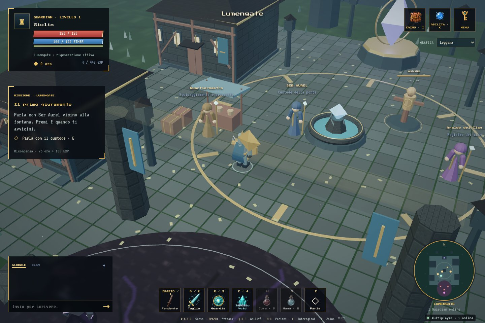

# Aetheria 3D · Lumengate

Ricostruzione parallela di **Aetheria — Shards of the Void** con TypeScript, Three.js, Rapier e Colyseus. L'obiettivo è mantenere il gioco di `Giulio001/RoundWorld`, portandone mondo e personaggi in 3D. Nessun editor o engine esterno è richiesto.

**ATesting è separato da Aetheria 2D online.** Server, salvataggi, porte e configurazione di deploy sono indipendenti. Questa versione porta il primo nucleo RPG, la Frontiera e il Bosco Sommerso collegati a Lumengate; non contiene ancora tutto il mondo e tutti i sistemi del gioco originale.



[Zaino desktop](docs/inventory-desktop.jpg) · [HUD mobile](docs/lumengate-mobile.jpg) · [Zaino mobile](docs/inventory-mobile.jpg)

## Aggiornare e avviare sulla VPS Windows

Ferma le vecchie finestre client/server con **Ctrl+C**. Nella cartella del repository:

```powershell
cd C:\Users\Administrator\Desktop\3DAETHERIA\ATesting
git pull
npm install
npm run dev:remote
```

Questo singolo comando avvia server e client accessibile dall'esterno. Lascia il terminale aperto e visita **http://169.58.82.19:5188** dal tuo PC. Dopo l'aggiornamento ricarica con **Ctrl+F5**.

La regola firewall TCP 5188 già aperta continua a essere sufficiente. Il server multiplayer ascolta su **127.0.0.1:2588**; il browser usa la stessa porta 5188 anche per il WebSocket attraverso il proxy `/multiplayer`. Le porte e i file Caddy di Aetheria 2D non vengono modificati.

Per una nuova installazione serve Node.js **22.12+**:

```bash
git clone https://github.com/Giulio001/ATesting.git
cd ATesting
npm install
npm run dev
```

`npm run dev` apre il client locale su http://127.0.0.1:5188. `npm run dev:remote` lo espone sulle interfacce di rete; per una prova su telefono, apri `http://IP_DEL_PC:5188` sulla stessa rete Wi-Fi.

## Giocare

Inserisci il nome, scegli **Guerriero, Arciere o Mago** ed entra a Lumengate. Il cammino è salvato insieme al personaggio; puoi cambiarlo dal pannello Personaggio mentre sei in città, conservando progressi e oggetti. **Il movimento è sempre corsa**, anche sul joystick: non serve Shift e non esiste una modalità camminata.

| Azione          | Desktop                                    | Mobile                  |
| --------------- | ------------------------------------------ | ----------------------- |
| Corsa           | WASD / frecce                              | Joystick sinistro       |
| Attacco base    | Click sinistro, tieni premuto / Spazio / 1 | Pulsante spada          |
| Taglio d'Aether | Q / 2                                      | Taglio                  |
| Scudo d'Aether  | R / 3                                      | Guardia                 |
| Impulso Void    | F / 4                                      | Impulso                 |
| Pozione salute  | H                                          | Cura                    |
| Pozione mana    | G                                          | Mana                    |
| NPC             | E                                          | Parla / Negozia / Clan  |
| Zaino           | I                                          | Menu → Zaino            |
| Abilità         | K                                          | Menu → Abilità          |
| Missioni        | J                                          | Menu → Missioni         |
| Clan            | C                                          | Menu → Clan             |
| Personaggio     | P                                          | Menu → Personaggio      |
| Mappa           | M                                          | Menu → Minimappa        |
| Chat            | Invio                                      | + nella barra chat      |
| Chiudi pannello | Esc                                        | ×                       |
| Zoom            | Rotellina sul mondo                        | Inquadratura automatica |

Il movimento determina la direzione del personaggio; il mouse permette di mirare un colpo. La minimappa distingue giocatori, NPC, nemici e fenditura. Su telefono, vicino a un NPC, il pulsante principale di attacco diventa il pulsante di interazione.

### Prima missione e progressione

1. Parla con **Ser Aurel** vicino alla fontana. Accetta il primo giuramento.
2. Attraversa la porta sud e sconfiggi **tre Schegge del Vuoto**. I cerchi rossi annunciano gli attacchi: esci dall'area prima dell'impatto.
3. Raccogli EXP, oro e materiali nello zaino. I partecipanti che contribuiscono al combattimento ricevono credito.
4. Torna dal custode per **75 oro + 100 EXP**. La ricompensa si riscuote una sola volta.
5. Puoi fondare un clan dall'**Araldo**, a est della fontana, oppure affrontare il **Custode del Vuoto**, che lascia anche una spada rara.

La città è sicura: rigenera HP e il custode cura/rifornisce. Le creature restano nella zona ostile a sud. Se muori, torni in città dopo quattro secondi. Le schegge ricompaiono dopo 20 secondi, il Custode dopo 45. Il manichino in piazza resta disponibile per provare attacchi e skill.

### Terre Sanguinanti: seconda zona 3D

Dopo aver riscosso il primo giuramento, **parla di nuovo con Ser Aurel**: ricevi Risonanza dello Scudo. Segui il sentiero e il ponte a **est** della città. L’avamposto all’ingresso è sicuro; l’Esploratore ripristina vita e mana. Oltre l’avamposto comincia la zona ostile.

1. Sconfiggi **cinque creature corrotte**: Slime, Creature del Vuoto o Sputaschegge. Il credito è condiviso con chi partecipa allo scontro e il progresso è personale e persistente.
2. Raggiungi il **Faro d’Aether** ed esamina la bruciatura con E o Esamina. Leggi l’indizio e scegli cosa accomuna le creature. Le risposte vengono controllate dal server e richiedono la vicinanza al faro.
3. Affronta il **Campione Cavo**, nella radura a est del faro. La sua area d’attacco cresce sotto metà vita. Gli Sputaschegge lasciano invece il loro avviso sul punto in cui ti trovavi: spostati prima dell’impatto.
4. Torna da **Ser Aurel**: il premio comprende 100 oro, l’EXP del primo capitolo originale, 10 Polveri d’Aether, 2 pozioni e 2 Gelatine Eteree. Si riscuote una sola volta. Se lo zaino è pieno, libera spazio e riparla con il custode.

Il Campione lascia anche un’arma rara per il tuo cammino. Il ponte permette di tornare a piedi; Menu → Torna in città resta disponibile quando sei lontano dai nemici. In caso di morte torni a Lumengate, conservando i progressi della missione. La minimappa passa alla Frontiera e mostra il faro, l’avamposto e le creature.

La mappa è una prima ricostruzione procedurale 3D. Il capitolo riprende le cinque creature e il quesito sulla corruzione dall’originale; il Campione Cavo è adattato a scontro finale di questa zona. Non è ancora la mappa completa né l’intera campagna di RoundWorld.

### Bosco Sommerso: terza zona 3D

Completata la Frontiera, **torna dal Custode del Bosco** all’imbocco orientale del sentiero. La regione è un antico bosco allagato, raggiungibile proseguendo a est oltre le Terre Sanguinanti: alberi sommersi, colonne spezzate, canali stagnanti e l’**Altare Sommerso** che pulsa di luce verde.

1. Parla con il **Custode del Bosco**: accetti la reliquia e la caccia alle **Creature Annegate**. L’avamposto cura subito vita e mana.
2. Sconfiggi **sei Creature Annegate** tra i canali (x 92–122). Il credito resta condiviso e personale, come nella Frontiera, e non alimenta più il conteggio della Frontiera precedente.
3. **Tocca l’Altare Sommerso** e interpreta la reliquia: la risposta corretta risveglia il **Guardiano Annegato**, che prima non può essere ferito.
4. Affronta il **Guardiano Annegato** (2200 HP, area più ampia sotto metà vita). La sua ricompensa comprende 180 oro, l’EXP della catena 1–8, 14 Polveri d’Aether, 3 pozioni e 3 Gelatine Eteree.
5. Torna dal **Custode del Bosco** per riscuotere una sola volta. Se lo zaino è pieno, libera spazio e riparla con lui.

Il combattimento, il diario quest e la minimappa passano automaticamente alla terza area (tinta nebbia verde, reliquia animata sull’altare e anello dell’arena). La missione riprende le identità originali del Bosco Sommerso: le Creature Annegate e il Guardiano sono adattati agli stessi parametri condivisi di collisione, aggro e ricompensa delle altre zone.

Lumengate ha una piazza con mosaici e intarsi in ottone, anelli animati sul cristallo della fontana, fioriere alle finestre, stemmi cittadini e un mercato con tendone a righe. Gli ornamenti ripetuti e la vegetazione usano geometrie istanziate; i nuovi dettagli non aggiungono luci dinamiche.

Case, mura, torri, porte, chiese, mulini e alberi sono **architettura procedurale a superficie curva** (`apps/client/src/world/Architecture.ts`): tetti a botte e spioventi, torri cilindriche con merli, archi estrusi, absidi, guglie e plinti. Niente più kit esagonale a blocchi: le forme sono smussate e in ombreggiatura liscia, con texture PBR generate su canvas a 512 px (albedo + bump) da `apps/client/src/world/Art.ts` per pietra, intonaco, travi, tegole, ardesia, paglia, ciottoli, marmo e acqua. La disposizione resta ancorata ai collider condivisi client/server: le case seguono l'impronta dei collider, il muro perimetrale lascia libero il varco est verso la Frontiera e la vegetazione ripetuta è raggruppata in `InstancedMesh`. Il vetusto kit GLB _KayKit Medieval Hexagon_ resta in `apps/client/public/assets/world/medieval/` solo come riferimento e per il controllo automatico `npm run test:city`; non viene più caricato dal gioco.

Una schermata di caricamento mostra la preparazione del mondo e, dopo aver premuto Entra, la connessione e la sincronizzazione del personaggio. I controlli si attivano quando la scena è pronta; in caso di errore puoi riprovare o tornare alla selezione del personaggio.

### Zaino, equipaggiamento e negozio

Lo zaino riprende la capacità originale: **72 oggetti, tre pagine da 24**, con gli otto slot **testa, collo, corpo, arma, scudo, anello, piedi, compagno**. Seleziona un oggetto per vedere i bonus; doppio clic o **Equipaggia** per indossarlo. La × sullo slot lo rimuove. Bonus di vita, attacco e difesa vengono applicati dal server. Rimuovere l'arma impedisce di attaccare.

Il **Quartiermastro**, al banco a ovest della fontana, vende pozioni, una spada e stivali. Gli acquisti sono possibili solo vicino all'NPC e solo se hai abbastanza oro. Il catalogo, i nomi, le rarità, le regole di classe e i valori intrinseci dell'equipaggiamento sono portati dal progetto originale; questa zona rende ottenibile un primo sottoinsieme di oggetti.

### Commercio tra giocatori

Due giocatori vicini (entro **4,5 metri**) possono scambiarsi oggetti e oro. Apri **Menu → Scambio**: il pannello elenca i compagni nelle vicinanze e invia la proposta. Il destinatario riceve la richiesta e può accettare o rifiutare.

Quando lo scambio è aperto, entrambi compongono la propria offerta scegliendo oggetti dalla sacca e indicando l'oro. Gli oggetti offerti restano nel tuo zaino ma vengono **bloccati**: non puoi equipaggiarli, riciclarli o offrirli altrove finché lo scambio è aperto. Nessun oggetto viene distrutto in anticipo, quindi un annullamento, un allontanamento, una morte o una disconnessione restituiscono tutto senza perdite. Il passaggio avviene solo alla **doppia conferma** ("Sono pronto" da entrambi) ed è atomico: il server controlla la capienza degli zaini e la disponibilità dell'oro, poi sposta oggetti e oro in un'unica operazione. Il kit iniziale e l'equipaggiamento indossato non sono scambiabili. Lo scambio si annulla automaticamente se vi allontanate, se uno dei due muore o si disconnette, o se l'invito resta in sospeso troppo a lungo.

### Tre cammini e combattimento

- **Guerriero (Guardian)**: spada e scudo, fendenti in mischia, Taglio d’Aether, Guardia e Impulso Void.
- **Arciere (Aether Ranger)**: arco, frecce con movimento e collisioni gestiti dal server, Freccia d’Aether e raffica di tre frecce. Ogni freccia della raffica infligge il 55% del danno base.
- **Mago (Void Mage)**: scettro, dardi arcani, raggio che trapassa i bersagli in linea e nova a 4,2 metri davanti al personaggio. La barriera costa 22 mana e non consuma vigore.

Q / R / F mantengono gli stessi posti nella barra rapida; nomi, icone e pannello abilità seguono il cammino scelto. Le restrizioni di armi e scudi vengono applicate dal server. Il negozio vende anche arco e bastone; il Custode lascia un’arma rara del cammino attuale.

Gli effetti hanno colori distinti: oro per le lame, verde etereo per le frecce, viola per la magia. Scie, scintille, raggio a più strati, nova e barriera usano bagliori e luci temporanee. La barriera segue chi la lancia. La modalità Alta/Automatica desktop usa bloom; Leggera riduce i passaggi grafici. Le tre classi usano modelli **GLB riggati e animati** (set CC0 KayKit: cavaliere, ladro incappucciato e mago), con arco e faretra, spada e scudo, scettro e vesti già presenti nella mesh. Le figure procedurali restano solo come fallback se un GLB non si carica.

### Forgia

Il **Fabbro**, a ovest della fontana, apre la forgia con E o il pulsante Forgia. Puoi aprire l’anteprima anche da Menu → Forgia, ma le operazioni richiedono la vicinanza al Fabbro.

Le creature lasciano Polvere d’Aether (1 per scheggia, 4 per Custode) e possono lasciare materiali della Frontiera. Il pannello mostra i bonus attuali, quelli del prossimo gradino, oro, polvere, materiali e probabilità. Il potenziamento arriva a **+9**: fino al +5 è garantito; dal +6 le probabilità originali sono 85%, 55%, 40% e 30%. Dal +5 servono anche materiali. Un fallimento consuma risorse e conserva l’oggetto e il suo gradino.

Puoi riciclare equipaggiamento non indossato per recuperare polvere: il pannello chiede una seconda conferma prima di distruggerlo. Il kit iniziale è protetto. Costi, crescita delle statistiche intrinseche e valore del riciclo provengono dal gioco originale. La riforgiatura degli affissi resta da portare.

### Abilità del Guardian

| Abilità         | Costo               | Ricarica | Effetto                                    |
| --------------- | ------------------- | -------- | ------------------------------------------ |
| Taglio d'Aether | 18 mana             | 2,6 s    | Cono frontale, 132 danni base              |
| Scudo d'Aether  | 12 mana + 30 vigore | 6,5 s    | Danni ridotti del 60% per 2,5 s            |
| Impulso Void    | 52 mana             | 7 s      | Onda radiale, 175 danni base e stordimento |

Sono i valori del Guardian originale. L'equipaggiamento aumenta il danno. L'attacco base consuma 25 vigore; mana e vigore si rigenerano. Una pozione salute ripristina 45 HP, una di mana 50 MP, con ricariche di tre secondi. La curva EXP e il limite del personaggio a livello 99 sono portati dall'originale; i contenuti di questa prima zona restano introduttivi.

### Clan e chat

La fondazione richiede **100 oro** e la vicinanza all'Araldo. Il pannello Clan mostra registro, richieste, membri, ruoli e tesoreria. Il fondatore accetta le richieste e può rimuovere membri; i membri possono donare oro e lasciare il clan. Un fondatore solo può scioglierlo. La chat ha canali **Globale** e **Clan**, verificati dal server.

## Salvataggi dell'esperimento

Il server salva personaggi, EXP, livello, oro, missione, pozioni, inventario, equipaggiamento e clan in **`data/aetheria-3d.json`**, relativo alla directory di lavoro del server. Con i comandi npm workspace il percorso è **`apps/server/data/aetheria-3d.json`**. `DATA_FILE` permette di scegliere un percorso assoluto diverso. La scrittura sostituisce atomicamente il file; i salvataggi sono esclusi da Git.

Il browser conserva una chiave privata che riconosce il personaggio dell'esperimento dopo una ricarica. Non viene usato l'account di Aetheria 2D. Browser/dispositivi diversi creano personaggi diversi; cancellare i dati del browser perde la chiave locale. Non condividere la chiave né il file dei salvataggi. Per provare due giocatori apri un secondo browser o una finestra privata.

## Grafica e asset

Lumengate ha materiali dipinti generati localmente, fontana, botteghe, arco sud, fenditura, luci, ombre, riflessi e VFX. Gli elementi davanti alla camera sfumano quando nascondono il Guardian. Il cielo è una **cupola atmosferica reale** (`three/addons/objects/Sky.js`): la stessa direzione del sole alimenta la luce chiave e l'ambiente PMREM con cui i materiali PBR reagiscono, e la tinta cambia per regione (Lumengate, Frontiera, Bosco Sommerso) insieme a nebbia e foschia. Eroi, abitanti e nemici restano **modelli GLB CC0 KayKit** in `characters/` ed `enemies/`; la città non usa più GLB ma geometria procedurale texturizzata. **Grafica → Alta** attiva ombre e bloom; **Leggera** riduce il costo GPU, l'anisotropia e il rilievo delle texture. **Automatica** sceglie la modalità leggera sui dispositivi touch.

La HUD riprende il riferimento originale **Ossidiana & Ottone**, i font Press Start 2P / VT323 e le icone di Aetheria. Cataloghi e asset trasferiti sono elencati in [parità con Aetheria](docs/aetheria-parity.md).

Eroi, abitanti e nemici sono **modelli GLB riggati e animati**, non più figure procedurali: `apps/client/public/assets/characters/` contiene guerriero, arciere e mago, mentre `apps/client/public/assets/enemies/` raccoglie le varianti nemiche scheletro. I file sono CC0 (KayKit) con texture incorporate, esportati lungo +Y e rivolti verso +Z. `apps/client/public/assets/manifest.json` associa ogni chiave al modello e all'altezza desiderata:

```json
{
  "characters": { "warrior": { "url": "./assets/characters/warrior/warrior.glb", "height": 1.85 } },
  "enemies": { "minion": { "url": "./assets/enemies/minion/minion.glb", "height": 1.7 } }
}
```

Il gioco risolve per nome le clip `Idle`, `Run`, `Attack01`, `Attack02`, `Attack03`, `Block`, `Hit`, `Death` e `Skill01`, con alias per ruolo (mischia, distanza, magia e mostri) perché i pacchetti non contengono le stesse animazioni. La scala è normalizzata sull'altezza dello scheletro in bind pose, così elmi, code e armi non alterano le proporzioni. Il gioco seleziona sempre **Run** quando si muove; `Walk` non viene riprodotta. `VITE_WARRIOR_URL` sostituisce il solo guerriero e il fallback procedurale resta attivo se un GLB non si carica.

## Verifiche e struttura

```bash
npm ci
npm run typecheck
npm test
npm run test:town
npm run test:city
npm run build
npm run test:integration -- --built
```

I test coprono fisica/collisioni/corsa, validazione dei pacchetti, combattimento, missioni cooperative, morte, pozioni, **commercio tra giocatori** (swap atomico, annullamento, allontanamento, zaino pieno, oggetti protetti) e persistenza dopo un riavvio. Il test con client Colyseus reali controlla sincronizzazione, cooldown, NPC, bottino, proprietà degli oggetti, equipaggiamento, **scambio di oro fra due client**, clan, chat e riconnessione. La CI esegue gli stessi controlli sul server compilato.

```text
apps/client/src/
  engine/       game loop, renderer, camera, asset loader, audio, qualità grafica
  world/        Lumengate (architettura curva procedurale), texture dipinte, collisioni visive, occlusione
  player/       Warrior e input desktop/touch
  combat/       creature e aree di attacco
  animation/    AnimationMixer e clip GLB
  network/      Colyseus, eventi gameplay, identità locale
  vfx/          fendenti, onde, scudo, impatti
  ui/           HUD, zaino, abilità, missioni, scambio fra giocatori, clan, chat, mappa
apps/server/src/
  rooms/        simulazione autoritativa a 30 Hz, patch a 15 Hz
  world/        incontri, missione, ricompense, respawn
  rpg/          inventario, negozio, commercio, clan, chat, salvataggi separati
packages/shared/src/
  aetheria/     cataloghi e regole portate da RoundWorld
  index.ts      mondo, input e combattimento condivisi
  rpg.ts        oggetti, NPC, abilità e protocollo RPG
  PhysicsWorld.ts  Rapier e character controller
  schema.ts     stato sincronizzato
```

## Build e deploy

Il build produce `apps/client/dist` e `apps/server/dist/index.js`; `npm start` avvia il server compilato. Per servire il client statico configura un reverse proxy dedicato che inoltri **HTTP matchmaking e WebSocket** da `/multiplayer/*` alla porta 2588, rimuovendo il prefisso. La configurazione development di Vite non viene inclusa nel build statico. Nessuna configurazione del sito 2D viene applicata da questo repository.

| Servizio                   | Porta |
| -------------------------- | ----- |
| Client                     | 5188  |
| Server, loopback           | 2588  |
| Test integrazione, isolato | 2589  |

Endpoint di stato: `http://127.0.0.1:2588/health`.

## Porting successivo

La destinazione resta **Aetheria con rendering 3D**. Mancano ancora i talenti e la progressione completa dei cammini, i modelli definitivi, il mondo completo, la campagna originale, gli altri NPC, talenti, riforgiatura degli affissi, compagni, party, commercio/aste, dungeon, Tower, PvP, castelli/attività clan e autenticazione completa. Il documento di parità distingue quanto è già funzionante dai sistemi da portare: nessun pannello vuoto viene presentato come un sistema completo.
