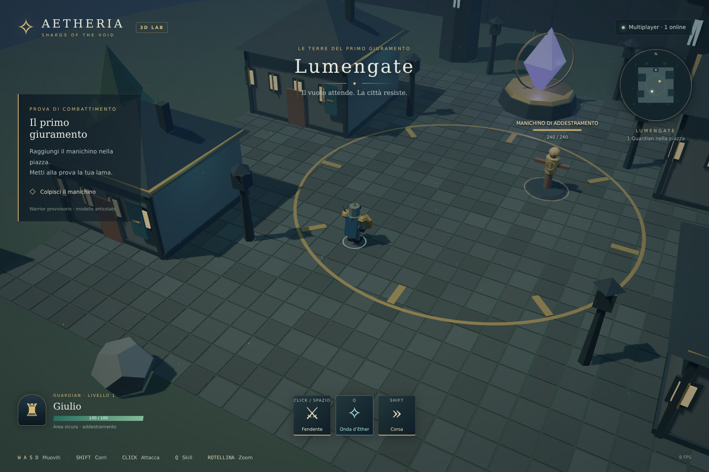

# Aetheria 3D · Lumengate experiment

A playable, independent 3D experiment for **Aetheria — Shards of the Void**. TypeScript, Three.js, Rapier and Colyseus, developed entirely from the command line. No Unity, Godot or Unreal project is required.

**This repository is isolated from the live Aetheria 2D game.** It does not import its server, database, accounts, assets, launcher or deployment configuration. All progress here is temporary and room-local.

## Preview



[Portrait mobile preview](docs/lumengate-mobile.png). These are screenshots of the playable prototype, with the provisional Warrior.

## Play locally

Install **Node.js 22.12+** (Node 24 LTS recommended), then:

```bash
git clone https://github.com/Giulio001/ATesting.git
cd ATesting
npm install
npm run dev
```

The browser opens at **http://127.0.0.1:5188**. Enter a name and click **Entra a Lumengate**. The command starts both the client and the multiplayer server. On subsequent updates use `git pull`, `npm install`, `npm run dev`.

Open the same address in another tab or browser to see another Guardian in the same plaza. There are up to 16 players per room. Stop both processes with Ctrl+C.

### Controls

| Action      | Desktop                                   | Mobile                                 |
| ----------- | ----------------------------------------- | -------------------------------------- |
| Move        | WASD / arrow keys, relative to the camera | Left joystick                          |
| Run         | Hold Shift                                | Hold Corsa while moving                |
| Sword slash | Left click on the ground/target, or Space | Fendente button                        |
| Ether wave  | Q                                         | Onda d’Ether button                    |
| Camera zoom | Mouse wheel                               | Automatic framing for portrait screens |

Walking controls facing; clicking aims the sword toward the cursor. On mobile, the last movement direction controls facing. The Ether wave is radial. Get near the golden training dummy and face it to land a sword hit.

## Included in this first slice

- A small procedural Lumengate plaza: paving, buildings, distant towers, trees, rock formations, crystal shrine, lanterns, shadows and ambient particles.
- An original **provisional articulated Warrior**, with sword, shield, blue cape, walk/run cycles, turning and attack poses. This is a geometry-based prototype, not the final production character.
- A follow camera, keyboard movement, mobile joystick, sprinting, bounded map and Rapier collision against buildings and obstacles.
- Sword slash, radial Ether wave, hit particles, floating damage, a shared dummy HP bar, server cooldowns and a six-second dummy respawn.
- Multiplayer with authoritative simulation, client prediction/reconciliation and interpolated remote players.
- A HUD, minimap, player names, a small onboarding objective, synthesized hit sounds and a reconnect button when disconnected.
- Optional animated GLB loading with `GLTFLoader`, skeleton-safe cloning and `AnimationMixer` crossfades.

The Guardian HP display is a fixed safe-area indicator; the dummy does not attack. There are no accounts, save files, quests, inventory, PvP or MMO persistence yet. The camera has a fixed angle; this slice tests a high action-RPG view.

## Use a real Warrior GLB

Place the exported model at:

```text
apps/client/public/assets/characters/warrior/warrior.glb
```

Change `apps/client/public/assets/manifest.json` to:

```json
{ "warrior": "./assets/characters/warrior/warrior.glb" }
```

The model is normalized to a height of 1.85 units. Export upright along **+Y**, facing **+Z**, with applied transforms, a skeleton, embedded textures and animations in the same GLB. Use in-place movement clips, with no root translation across the floor. The loader cannot create a missing skeleton or repair a broken rig.

Expected clip names, matched without case sensitivity:

```text
Idle, Walk, Run, Attack01, Attack02, Attack03,
Block, Hit, Death, Skill01
```

Missing attacks fall back to `Attack01`, and other missing clips to `Idle`. `Block`, `Hit` and `Death` are supported by the animation controller but are not gameplay actions in this slice. Use `Idle`, `Walk`, `Run`, `Attack01` and `Skill01` for the first model. If the GLB fails to load, the procedural Warrior remains playable.

For an external model URL, copy `apps/client/.env.example` to `apps/client/.env.local` and set `VITE_WARRIOR_URL`. Only commit models you own or have permission to redistribute; this is a public repository. The initial experiment contains no downloaded third-party art or audio.

## Test on a phone

Keep the server running, and run the client on the LAN:

```bash
# Terminal 1
npm run dev -w @aetheria/server
# Terminal 2
npm run dev:lan -w @aetheria/client
```

Open `http://YOUR_PC_LAN_IP:5188` from a phone on the same Wi-Fi. Allow port 5188 through the PC firewall if necessary. The Vite proxy keeps the room server on loopback; phones use the same client address for HTTP and WebSocket traffic. Do not open ports from the existing Aetheria installation.

For Codespaces, forward **5188** and use its browser URL; the same-origin proxy handles the multiplayer connection. Explicitly configure a trusted hostname in Vite if your environment requires it, rather than disabling host validation.

## Ports and deployment

| Service                 | Experiment default | Configuration                        |
| ----------------------- | ------------------ | ------------------------------------ |
| Browser / Vite          | 5188               | `apps/client/vite.config.ts`         |
| Room server             | 2588, on 127.0.0.1 | `PORT`, `HOST` environment variables |
| Integration-test server | 2589               | Test script                          |

No existing Aetheria ports or Caddy files are changed. Build with `npm run build` and start the built server with `npm start`. The static client is output to `apps/client/dist`; the bundled server to `apps/server/dist/index.js`. Serve the client and reverse-proxy `/multiplayer/*` to the experiment server, stripping the `/multiplayer` prefix for **both HTTP matchmaking and WebSocket upgrades**. If hosting separately, build the client with `VITE_SERVER_URL` pointing to the dedicated experiment endpoint. Use a separate hostname or local instance, with HTTPS/WSS for internet use. Vite's development proxy does not exist in a static production build.

The server's read-only health endpoint is `http://127.0.0.1:2588/health`. This slice is for development: no production account authentication, persistent storage or public deployment is included.

## Structure

```text
apps/client/src/
  engine/       renderer, camera, game loop, GLB loader, audio
  world/        procedural Lumengate scene
  player/       Warrior and keyboard/touch input
  animation/    GLB clip selection and crossfades
  network/      Colyseus connection and messages
  vfx/          sword arcs, Ether rings, hit particles
  ui/           HUD, minimap and world-space labels
apps/server/src/
  rooms/        authoritative Lumengate simulation and combat
packages/shared/src/
  index.ts      map geometry, controls, validation and combat rules
  PhysicsWorld.ts  shared Rapier world and character controller
  schema.ts     synchronized room/player state
tests/          unit physics/rules checks and real two-client networking test
```

Simulation runs at 30 Hz, with room patches at 15 Hz. Clients send sequenced input intentions; the server applies speed limits and collisions and acknowledges consumed input. Clients replay unacknowledged input after a state update. The server decides damage, facing, range, line of sight and cooldowns. Character-to-character collision is intentionally disabled in this safe test area. The flat plaza keeps a stable capsule clearance above the floor; slopes and stair traversal are future work.

## Checks

```bash
npm ci
npm run typecheck
npm test
npm run build
npm run test:integration
```

The integration test starts an isolated server and checks two real clients, movement speed limits, state synchronization, malformed input, attack and skill cooldowns, idle stop, player cleanup, dummy defeat and respawn. After building, use `npm run test:integration -- --built` to test the compiled server. GitHub Actions checks the compiled server on push and pull requests.

## Next milestone

Replace the provisional Warrior with one approved, rigged GLB and verify its silhouette, all movement directions, sword grip, foot contact and attack transitions on desktop and iPhone. Then refine environment art and combat feel before adding another class or persistent systems.

Technical references: [Three.js](https://threejs.org/docs/), [Rapier character controller](https://rapier.rs/docs/user_guides/javascript/character_controller/), [Colyseus 0.16](https://0-16-x.docs.colyseus.io/), [Vite](https://vite.dev/).
