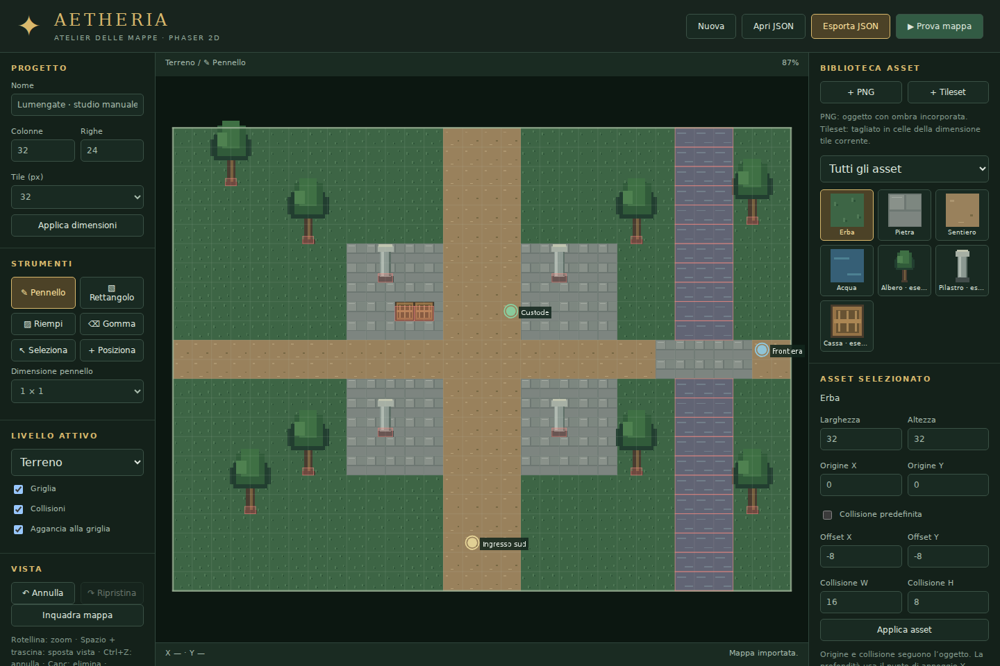

# Aetheria · Atelier delle mappe

Editor **2D manuale in HTML, JavaScript e Phaser 3.90**. App indipendente dal gioco Three.js di ATesting: non cambia mappe, server, porte o salvataggi del gioco 3D. Le mappe esportate usano un nuovo formato versionato; non sono ancora collegate al repository Aetheria 2D.



## Avvio su Windows / PC

Dalla cartella ATesting, con Node.js 22.12+:

```powershell
git pull origin main
npm ci
npm run editor
```

Apri **http://127.0.0.1:5190**. Il server dell'editor ascolta solo sul PC: non serve avviare il gioco o il multiplayer. Per usarlo da un altro dispositivo fidato in LAN:

```powershell
npm run dev -w @aetheria/map-editor -- --host 0.0.0.0
```

Build statica: `npm run build:editor`. Output: `apps/map-editor/dist/`; servilo tramite HTTP. Non aprire `index.html` con doppio click: usa il comando di avvio.

## Flusso di lavoro

1. Imposta nome, colonne, righe e tile. **Applica dimensioni** preserva le celle nella parte comune; ridurre i bordi rimuove gli elementi esterni. Cambiare dimensione tile scala le posizioni, mentre gli asset conservano la propria dimensione in pixel.
2. Scegli un terreno nella biblioteca. Dipingi trascinando; usa Rettangolo, Riempi o Gomma. La gomma crea celle trasparenti. L'acqua di esempio è solida per impostazione predefinita.
3. **+ PNG** importa uno o più oggetti, con trasparenza e ombra già incorporata se presente. Imposta dimensioni visuali, origine e collisione dell'asset. **+ Tileset** divide un PNG in celle della dimensione tile corrente: niente margini/spaziatura, dimensioni multiple esatte del tile. Le celle vengono importate come terreni, senza autotiling.
4. Seleziona un oggetto nella biblioteca, poi clicca la mappa. Con **Seleziona**, clicca e trascina le istanze. Ctrl+C/V duplica un elemento; Canc lo elimina. X/Y nel pannello destro consentono posizioni precise.
5. Il livello **Collisioni** permette di dipingere blocchi solidi, con pennello, rettangolo e riempimento. Le collisioni manuali **si sommano** a quelle del terreno e degli oggetti. La gomma rimuove i blocchi manuali; per rendere attraversabile un oggetto/terreno, modifica il suo asset.
6. Il livello **Gameplay** posiziona ingresso giocatore, NPC, nemici, boss, portali e punti zona. Nome/ID può identificare l'entità o la destinazione di un portale. Le zone sono punti di riferimento, non ancora aree poligonali. Un nuovo ingresso sostituisce il precedente.
7. **Prova mappa**: muovi il personaggio segnaposto con WASD/frecce. Corsa costante, collisione circolare, movimento diagonale normalizzato. La prova parte dall'ingresso o da una cella libera se l'ingresso è bloccato. Esc torna all'editor. I punti gameplay non attivano combattimenti o teletrasporti nella prova.
8. **Esporta JSON** salva mappa, catalogo PNG, posizioni, collisioni e gameplay in un solo file. **Apri JSON** ricostruisce il progetto. La bozza viene salvata nel browser dopo ogni modifica, quando la quota disponibile lo permette: conserva sempre un JSON esportato.

Rotellina: zoom centrato sul mouse. Spazio + trascina, tasto centrale o destro: panoramica. **Inquadra mappa** ripristina la vista. Ctrl+Z / Ctrl+Shift+Z (anche Cmd su Mac): annulla/ripristina. Fino a 30 operazioni, ogni trascinamento è una singola operazione. Il progetto di esempio è in `examples/lumengate-study.json`: aprilo con Apri JSON.

Gli asset incorporati di erba/pietra/acqua/albero/pilastro/cassa sono **segnaposto disegnati per l'editor**, non i definitivi del gioco. Non vengono aggiunte ombre geometriche sotto i PNG. Origine (0.5, 1) significa centro del bordo inferiore; la collisione usa offset in pixel rispetto a tale punto. La profondità Phaser di un oggetto è la sua Y: un personaggio con profondità Y passa correttamente davanti/dietro.

## Integrazione nel gioco Phaser

Copia `src/phaser-map.js`, `src/model.js` e `src/textures.js` nel progetto 2D. `renderMap` carica le texture incorporate, crea terreno e oggetti e restituisce collider e punti gameplay:

```js
import { renderMap } from './maps/phaser-map.js';

// preload() della scena:
this.load.json('region', 'maps/la-mia-regione.json');

// create() della scena (gestire la Promise e bloccare l'input fino al completamento):
const region = await renderMap(this, this.cache.json.get('region'));
this.physics.world.setBounds(0, 0,
  region.map.width * region.map.tileSize,
  region.map.height * region.map.tileSize);
const walls = this.physics.add.staticGroup();
for (const rect of region.collisions) {
  const zone = this.add.zone(rect.x + rect.width / 2,
    rect.y + rect.height / 2, rect.width, rect.height);
  this.physics.add.existing(zone, true);
  walls.add(zone);
}
this.physics.add.collider(player, walls);
// Usa region.markers per istanziare gli NPC/nemici/portali del tuo gioco.
// Nel loop: player.setDepth(player.y).
// Cleanup: walls.clear(true, true); region.destroy();
```

Il loader non configura automaticamente fisica, camera, NPC o protocolli server. In Colyseus/Node importa **solo `model.js`**: `validateMap`, `collisionRectangles` e `canStand` sono indipendenti dal browser. Il server deve caricare la **stessa mappa autorizzata dal deploy**, non fidarsi di JSON inviati dai giocatori. Se il gioco usa corpi Arcade rettangolari, allinea la forma del corpo del giocatore alle proprie regole; la prova usa un cerchio di raggio 9 px.

## Limiti e verifica

8–256 celle per lato; tile 16/32/48/64; massimo 2048 asset, 10.000 oggetti e 2000 punti gameplay. PNG oggetto fino a 2048 px per lato; tileset fino a 8192; ogni upload fino a 10 MB; JSON esportabile/importabile fino a 40 MB. Progetti grandi con PNG incorporati consumano più memoria e possono superare la quota browser. Mappe grandi su dispositivi deboli possono essere lente: il loader crea un'immagine Phaser per cella. Prima versione pensata per mouse e tastiera: niente multiselezione, rotazione, animazioni asset, collisioni poligonali o export Tiled TMJ.

```bash
npm run test:editor
npm run build:editor
```

I test verificano round trip, validazione, strumenti di pittura, resize, collider, ingresso, movimento senza attraversamento di ostacoli e cronologia. Il workflow dedicato verifica l'editor senza modificare quello del gioco 3D.
