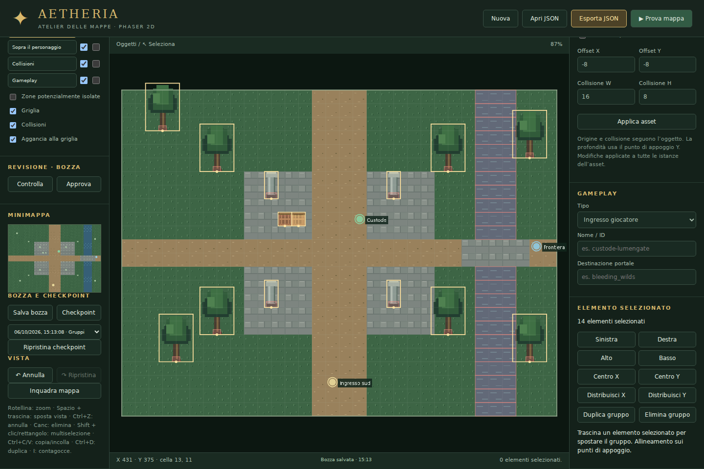

# Aetheria · Atelier delle mappe

Editor 2D manuale in HTML, JavaScript e Phaser 3.90. Include selezione multipla, allineamento, minimappa, checkpoint, livelli separati, collisioni per istanza, autotiling, revisione e biblioteca iniziale con **69 asset reali** e catalogo completo dei **3.437 file runtime** di Aetheria. È indipendente dal gioco Three.js di ATesting. L'export ha un loader Phaser incluso, ma non è ancora collegato al gioco 2D online.



## Avvio

Dalla cartella ATesting, con Node.js 22.12+:

```powershell
git pull origin main
npm ci
npm run editor
```

Apri **http://127.0.0.1:5190**. Non serve avviare il gioco o il multiplayer. Build statica: `npm run build:editor`, output `apps/map-editor/dist/`. Usa HTTP; non aprire index.html con doppio click.

Per la LAN: `npm run dev -w @aetheria/map-editor -- --host 0.0.0.0`. Login, salvataggi condivisi, inviti e modifica simultanea online non fanno parte di questa versione: i progetti restano JSON con bozza nel browser. Non è stato effettuato un deploy sulla VPS.

## Asset e terreno

**Carica asset Aetheria** aggiunge una biblioteca locale: erba/piazza di Lumengate, strade, acqua, ponte, barile, cassa, scrigno, cartello, fontana, pavimento/corpo/tetto di una casa, Pozzo dell'Infinito e lampioni. I 69 elementi comprendono le varianti dei terreni e degli autotile, non 69 edifici diversi. Sono PNG copiati dal repository del gioco, ritagliati secondo i rispettivi fogli; la fontana usa una posa statica. Non si aggiungono ombre geometriche ai PNG. Le collisioni suggerite sono modificabili: vanno verificate per la disposizione concreta della mappa.

Usa tile **48 px** per mantenere la risoluzione originale di questi terreni. Le dimensioni visuali degli oggetti sono in pixel e restano modificabili. La biblioteca si può caricare più volte senza duplicare gli asset. I ritagli importati vengono incorporati nel JSON: nessun accesso GitHub o URL esterno è necessario per riaprire una mappa. Le sorgenti e i crediti sono in `public/game-assets/`, incluso `SOURCE-CREDITS.md`.

### Catalogo completo del gioco

Premi **Catalogo completo Aetheria**: comprende tutti i file tracciati sotto `apps/client/public/assets/` del gioco alla revisione `eb748e2e596dbc303659adec24776868539b4fc7`: **3.355 immagini, 39 audio e 43 file di metadati/crediti**. Categoria, ricerca e paginazione consentono di esplorare la biblioteca. Seleziona un foglio, scegli il fotogramma/cella o imposta X/Y/larghezza/altezza e premi **Aggiungi alla mappa**. Gli atlanti supportati offrono elementi nominati. Le animazioni vengono importate come pose statiche. Audio e metadati sono consultabili/scaricabili, non elementi da posizionare sulla mappa.

Le immagini e gli audio originali vengono scaricati a richiesta dal server pubblico del gioco, verificati rispetto alla SHA Git della revisione e conservati nella cartella `.catalog-cache/` sul computer che ospita l'editor. Il primo utilizzo richiede Internet; se il gioco sostituisce un file, l'editor segnala la differenza e non importa una texture diversa. I metadati e i due SVG sono inclusi integralmente nel progetto. Due anteprime già corrotte nella sorgente (`hud_preview.png`, `verdant_frontier_preview.png`) sono indicate come non visualizzabili. **I PNG aggiunti alla mappa sono incorporati nel JSON**, quindi riaprire/exportare quella mappa non richiede il catalogo remoto.

Il catalogo completo richiede il server Node di `npm run editor` o `npm run preview -w @aetheria/map-editor`: il middleware Vite serve gli originali dalla cache e gestisce i download. Pubblicare solo `dist/` su hosting statico non offre questo endpoint; per renderlo online occorre ospitare il server oppure fornire un endpoint equivalente. Per provarlo con i collaboratori sulla LAN usa il comando riportato sopra; le bozze restano locali a ciascun browser.

**Cerca asset** filtra la palette per nome; la stella salva i preferiti in questo browser. **Contagocce (I)** campiona il terreno o l’oggetto dal livello attivo e torna al pennello/posizionamento. Le varianti autotile sono raggruppate nella palette.

**+ PNG** importa oggetti; **+ Tileset** divide un PNG in celle della dimensione tile corrente, senza margini né spaziatura. Seleziona un terreno e dipingi con Pennello, Rettangolo o Riempi. La gomma crea celle trasparenti. I terreni d'acqua sono solidi per impostazione predefinita; cambiare tale proprietà su un autotile aggiorna tutte le sue varianti.

## Livelli

| Livello              | Contenuto e profondità                            |
| -------------------- | ------------------------------------------------- |
| Terreno              | Griglia di tile, sotto gli altri elementi         |
| Dettagli             | PNG a terra, sotto il personaggio                 |
| Edifici              | PNG con ordinamento sul punto di appoggio Y       |
| Oggetti              | Alberi, lampioni, arredi con ordinamento Y        |
| Sopra il personaggio | Tetti/chiome sempre sopra personaggi e oggetti    |
| Collisioni           | Blocchi manuali dipinti sulla griglia             |
| Gameplay             | Ingresso, NPC, nemici, boss, portali e punti zona |

Le due caselle di ogni livello regolano **visibilità** e **blocco**. Un livello nascosto o bloccato non può essere modificato, neppure dal pannello istanza, con Canc o incolla. Per selezionare un oggetto, attiva il suo livello e usa Seleziona. I PNG della biblioteca suggeriscono il livello appropriato: un tetto va sopra il personaggio, un pavimento nei dettagli. Per allineare corpo/pavimento/tetto usa gli stessi X/Y: i tre fogli della casa hanno dimensioni e origine comuni.

Visibilità e blocco sono proprietà dell'editor: **Prova mappa e loader del gioco mostrano tutti i livelli**, e le collisioni rimangono attive. Nascondere un ostacolo per lavorare sul terreno non lo rimuove dal gioco.

## Selezione e composizione

Con **Seleziona**, Shift + clic aggiunge/rimuove elementi; trascina su uno spazio vuoto per selezionare i punti di appoggio dentro un rettangolo. Shift + rettangolo aggiunge alla selezione. Il livello attivo determina gli elementi selezionabili; Ctrl/Cmd+A seleziona tutti gli oggetti o marker di quel livello.

Trascina un elemento del gruppo per spostare l’intera selezione mantenendo le distanze. Lo snap arrotonda lo spostamento comune; il gruppo si ferma ai bordi della mappa. Nel pannello gruppo puoi allineare sinistra/destra/alto/basso/centro o distribuire almeno tre elementi lungo X/Y. **Allineamenti e distribuzioni usano i punti di appoggio**, non i bordi dei PNG.

Ctrl/Cmd+C e V copiano/incollano il gruppo con nuove istanze, conservando livelli e collisioni personali. Ctrl/Cmd+D duplica; Canc elimina la selezione. Le frecce spostano di 1 px, Shift + freccia di un tile. Ogni trascinamento/allineamento è una sola operazione annullabile. L’ispettore collisioni si apre selezionando una sola istanza.

La **minimappa** mostra terreno, oggetti e punti gameplay. Clicca per centrare la vista; il rettangolo indica l’area visibile. La navigazione è disattivata durante Prova mappa.

## Collisioni per istanza

Seleziona un oggetto e apri **Collisione di questa istanza**:

- **Eredita dall'asset** mantiene la collisione predefinita. È il comportamento iniziale.
- **Nessuna** rimuove soltanto la collisione di quell'oggetto.
- **Rettangolo personalizzato** usa offset X/Y, larghezza e altezza; oppure premi Disegna rettangolo e trascina sul canvas.
- **Poligono personalizzato** usa una riga `X, Y` per vertice; oppure premi Disegna poligono, clicca i vertici in ordine sul canvas e premi **Invio**. **Esc** annulla il disegno.

Coordinate e vertici sono locali rispetto al punto di appoggio dell'oggetto. Spostandolo, il collider lo segue. Le altre istanze restano invariate. Puoi anche cambiare il livello della sola istanza. I poligoni accettano 3–32 vertici e forme concave, ma rifiutano contorni che si incrociano, vertici duplicati consecutivi e area nulla.

Le collisioni dipinte, dei terreni solidi e degli oggetti si sommano. La gomma nel livello Collisioni rimuove solo i blocchi manuali. Per un ponte, dipingi un passaggio non solido sotto il PNG prima di posizionarlo nei Dettagli; il solo PNG non disattiva l'acqua sottostante. Il Pozzo non ha una collisione suggerita: definiscila per istanza secondo il varco che vuoi lasciare accessibile.

## Autotiling

Sentiero/acqua di esempio e strade/acqua Aetheria collegano automaticamente i bordi ai terreni dello stesso gruppo. Il calcolo avviene anche nel loader, dopo pennellate, gomma, riempimento, resize o importazione. La griglia salva il terreno logico e il catalogo salva le varianti.

Per un gruppo personalizzato usa **+ Autotile**, con un foglio **4 × 4 celle** della dimensione tile corrente, ordinato riga per riga da maschera 0 a 15. Somma N=1, E=2, S=4, O=8 per identificare le connessioni. Esempi: 0 isolato; 5 verticale; 10 orizzontale; 15 collegato sui quattro lati. Con tile 48, il PNG deve essere 192 × 192.

Il foglio acqua del gioco usa un formato blob diverso: la biblioteca contiene già la corrispondenza alle 16 connessioni cardinali. Questa versione non calcola angoli interni con adiacenze diagonali né transizioni arbitrarie fra due gruppi diversi. Le mappe v1 vengono migrate preservando il disegno originale, senza applicare retroattivamente autotiling ai vecchi terreni.

## Controlli e approvazione

**Controlla** elenca problemi cliccabili; clicca un problema associato a un elemento per centrare la vista e aprire l'ispettore. **Approva** richiede:

- Esattamente un ingresso giocatore, libero e sufficientemente lontano dal bordo.
- Portali con una **Destinazione portale** esplicita, separata dal nome, e posizione attraversabile.
- Asset presenti, griglie coerenti, livelli validi e collisioni valide.

Se i controlli falliscono, la mappa resta in bozza. L'approvazione viene salvata nel JSON; ogni modifica la riporta in bozza. Undo/redo possono recuperare una versione approvata identica. In importazione una mappa marcata approvata viene ricontrollata e torna in bozza se ha problemi. Le destinazioni sono ID da collegare al gioco: il controllo non verifica che una regione esterna esista già né garantisce la raggiungibilità di ogni punto della mappa. L'approvazione è uno stato locale del progetto, non una firma o un permesso di pubblicazione.

Il controllo dei percorsi segnala **avvisi** per portali, NPC, nemici e boss che potrebbero essere irraggiungibili dall’ingresso. **Zone isolate** colora in arancio le celle libere non collegate. L’analisi usa i centri delle celle, un personaggio di raggio 9 px e verifica i collegamenti contro rettangoli e poligoni: passaggi stretti o percorsi fra i centri possono produrre falsi avvisi. Gli avvisi non bloccano l’approvazione; verifica in Prova mappa.

## Prova, salvataggio e comandi

**Prova mappa** usa WASD/frecce, corsa costante, movimento diagonale normalizzato e collisione circolare di raggio 9 px. Le forme poligonali vengono controllate esattamente, anche nei loro incavi; il movimento usa sottopassi per non attraversare ostacoli sottili. Se l'ingresso è ostruito la prova può partire da una cella libera, ma l'approvazione rimane bloccata. Esc torna all'editor. I punti gameplay non attivano combattimenti o teletrasporti nella prova.

**Esporta JSON** salva tutto; **Apri JSON** ricostruisce il progetto. Le versioni 1 vengono aggiornate al formato 2. La bozza viene salvata automaticamente in **IndexedDB**, dopo una breve pausa dalle modifiche; lo stato è visibile nella barra sotto il canvas. **Salva bozza** forza il salvataggio. Le vecchie bozze localStorage vengono recuperate automaticamente; localStorage resta un ripiego se IndexedDB non è disponibile.

**Checkpoint** conserva le ultime **cinque versioni manuali**, incluse immagini e collisioni. Seleziona una versione e premi **Ripristina checkpoint**: il ripristino può essere annullato. Bozza, checkpoint e preferiti sono locali a questo browser e a questo indirizzo web; cambiare indirizzo/porta, cancellare i dati del sito o usare un altro dispositivo crea un archivio diverso. Conserva sempre un JSON esportato, soprattutto prima di svuotare i dati del sito. Il salvataggio può fallire se la quota browser è esaurita. Il progetto originale in `examples/lumengate-study.json` serve anche come esempio di migrazione; aggiungi la destinazione al suo portale per approvarlo.

Rotellina: zoom sul mouse. Spazio + trascina/tasto centrale/destro: panoramica. Inquadra mappa: ripristina vista. Seleziona + trascina: sposta la selezione. Shift + clic/rettangolo: multiselezione. Ctrl+C/V: copia/incolla; Ctrl+D: duplica; Ctrl+A: seleziona il livello; Canc: elimina. I: contagocce. Ctrl+Z / Ctrl+Shift+Z (anche Cmd): annulla/ripristina. Cronologia di 30 operazioni, ogni trascinamento conta come una sola.

## Integrazione Phaser e server

Copia `src/phaser-map.js`, `src/model.js` e `src/textures.js` nel gioco Phaser. Gestisci la Promise di `renderMap` e attiva il movimento solo dopo il caricamento:

```js
import { renderMap } from './maps/phaser-map.js';

// preload():
this.load.json('region', 'maps/la-mia-regione.json');

// Inizializzazione asincrona chiamata da create():
this.region = await renderMap(this, this.cache.json.get('region'));
// Istanzia gli NPC/portali da this.region.markers.

// update(): dopo aver calcolato dx/dy normalizzati per il delta del frame
if (this.region) {
  this.region.movePlayer(playerPosition, dx, dy); // { x, y }, raggio 9 px
  playerImage.setPosition(playerPosition.x, playerPosition.y).setDepth(playerPosition.y);
}
// Cleanup: this.region.destroy();
```

`region.collisions` contiene rettangoli **e poligoni**, in coordinate mondo; `region.canStand(x,y,radius)` usa entrambe le forme. Non trasformare i poligoni in corpi Arcade rettangolari: perderesti gli incavi. Usa le funzioni condivise o converti i contorni al sistema fisico del gioco.

Nel server Node/Colyseus importa **solo `model.js`**: validazione, `collisionShapes`, `canStand`, `movePlayer`, `reviewMap` sono indipendenti dal browser. Client e server devono usare la stessa mappa e le stesse regole di movimento. `collisionRectangles` resta un helper di compatibilità che restituisce i bounding box dei poligoni, adatto a visualizzazione grossolana, non alla fisica precisa. Il loader non configura camera, NPC, teletrasporti o protocolli server e non pubblica la mappa nel gioco.

## Limiti e verifica

8–256 celle per lato; tile 16/32/48/64; massimo 2048 asset, 128 gruppi autotile, 10.000 oggetti e 2000 marker. PNG oggetto fino a 2048 px per lato; tileset fino a 8192; upload fino a 10 MB; JSON fino a 40 MB. Mappe grandi consumano più memoria e possono superare la quota browser. Il loader crea un'immagine per cella: editor pensato per mouse/tastiera. Non include rotazione, animazioni asset o export Tiled TMJ.

```bash
npm run test:editor
npm run build:editor
```

24 test coprono migrazione, validazione, pittura, resize, collider rettangolari/poligonali, ereditarietà, livelli, 16 maschere autotile, approvazione, catalogo reale, cronologia, spostamento di gruppi, allineamento, distribuzione e analisi dei percorsi; inoltre completezza e SHA del catalogo, ritagli, provenienza nell’export e endpoint degli originali. Verificati anche nel browser caricamento biblioteca, blocco/visibilità, disegno dei collider, riparazione dei problemi di approvazione, invalidazione dopo modifica, pittura e round trip JSON; inoltre selezione a rettangolo, copia/eliminazione/undo di gruppi, ripristino checkpoint, recupero bozza al reload, ricerca/preferiti, contagocce, minimappa e avvisi di raggiungibilità.
